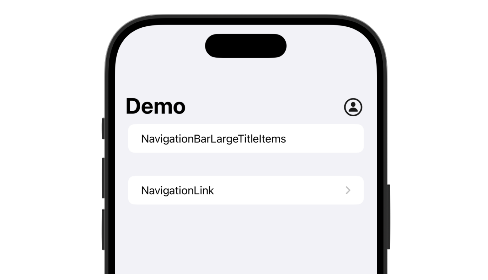

# NavigationBar Large Title Items

<p align="center">
  
</p>


> [!NOTE]
> This is only working with `NavigationView` and not with `NavigationStack`.

## Installation
### Swift Package Manager
Go to `File | Swift Packages | Add Package Dependency...` in Xcode and enter URL from this repository.


## Usage
```swift
import NavigationBarLargeTitleItems

var body: some View {
    NavigationView {
        List {
        
        }
        .navigationTitle("Demo")
        .navigationBarLargeTitleItems(trailing: <YOURVIEW>)
    }
}
```

## Examples
<details>
<summary>Using buttons</summary>

```swift
struct SwiftUIView: View {
    
    @State var isPresented: Bool = false
    
    var body: some View {
        NavigationView {
            List {
                Section {
                    Text("NavigationBarLargeTitleItems")
                }
                
                Section {
                    NavigationLink {
                        List {
                            Text("Demo")
                        }
                        .navigationTitle("Another view")
                    } label: {
                        Text("NavigationLink")
                    }
                }
            }
            .navigationTitle("Demo")
            .navigationBarLargeTitleItems(trailing: ProfileButton(isPresented: $isPresented))
        }
        .sheet(isPresented: $isPresented) {
            Text("Sheet content")
        }
    }
}
```

</details>


<details>
<summary>Simple text / image</summary>

```swift
struct SwiftUIView: View {
    var body: some View {
        NavigationView {
            List {
                Section {
                    Text("NavigationBarLargeTitleItems")
                }
                
                Section {
                    NavigationLink {
                        List {
                            Text("Demo")
                        }
                        .navigationTitle("Another view")
                    } label: {
                        Text("NavigationLink")
                    }
                }
            }
            .navigationTitle("Demo")
            .navigationBarLargeTitleItems(trailing: ProfileButton())
        }
    }
}
```

</details>

